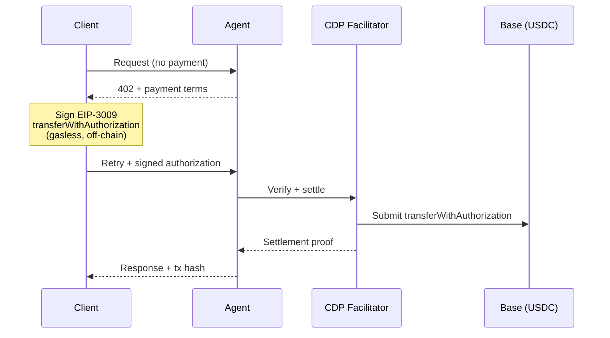
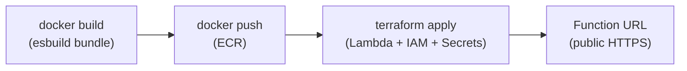
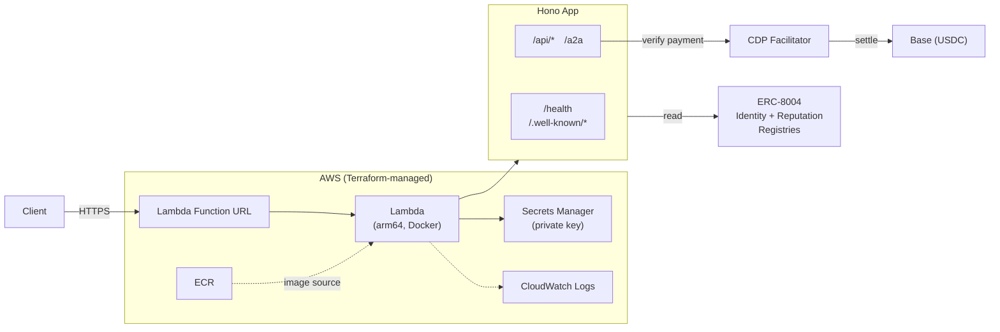

# Agent Trust Gateway

Trust scoring, identity profiles, and validation for on-chain registered agents ([ERC-8004](https://eips.ethereum.org/EIPS/eip-8004)). Pays-per-query via [x402](https://www.x402.org) (HTTP 402 protocol) with USDC on Base.

Built with [Hono](https://hono.dev), [A2A](https://google.github.io/A2A/) (Agent-to-Agent protocol), and [`agent0-sdk`](https://sdk.ag0.xyz/docs) for on-chain registration. Deployed as an AWS Lambda function.

## Live Instance

| | |
|---|---|
| **URL** | `https://agent-trust-gateway.port402.com` |
| **Agent ID** | [#21557 on 8004scan](https://www.8004scan.io/agents/base/21557) |
| **Network** | Base mainnet (`eip155:8453`) |
| **Payment** | USDC via x402 (paid endpoints return `402` without payment) |

## Endpoints

| Method | Path | Price | Description |
|--------|------|-------|-------------|
| `GET` | `/health` | Free | Health check |
| `GET` | `/api/health` | Free | API health check |
| `GET` | `/.well-known/agent-card.json` | Free | A2A agent card + entrypoints |
| `GET` | `/.well-known/agent-registration.json` | Free | On-chain identity link |
| `GET` | `/api/agent/:id/profile` | $0.001 | Agent identity and registration metadata |
| `POST` | `/api/agent/profile/invoke` | $0.001 | Same as above (A2A invoke envelope) |
| `POST` | `/api/agent/score/invoke` | $0.01 | Trust score from reputation data |
| `POST` | `/api/agent/validate/invoke` | $0.03 | Deep validation of endpoints + attestations |
| `POST` | `/a2a` | $0.01 | A2A task execution (`message/send`) |

## API Reference

### Health Check

```bash
curl https://agent-trust-gateway.port402.com/api/health
```

```json
{ "ok": true, "service": "agent-trust-gateway" }
```

### Agent Profile — `GET /api/agent/:id/profile`

Returns agent identity, registration metadata, endpoints, and wallet info. Supports multi-chain via `?chain=` query param (`base`, `base-sepolia`, `ethereum`, `sepolia`).

```bash
curl https://agent-trust-gateway.port402.com/api/agent/42/profile?chain=base
```

```json
{
  "agentId": "42",
  "chain": "base",
  "owner": "0x1234...abcd",
  "wallet": "0x1234...abcd",
  "name": "Example Agent",
  "description": "An ERC-8004 registered agent",
  "image": "ipfs://Qm...",
  "endpoints": [
    { "name": "A2A", "endpoint": "https://example.com/a2a" }
  ],
  "supportedTrust": ["reputation"],
  "active": true,
  "registrations": [
    { "agentId": 42, "agentRegistry": "eip155:8453:0x8004A169FB4a3325136EB29fA0ceB6D2e539a432" }
  ]
}
```

### Trust Score — `POST /api/agent/score/invoke`

Computes a trust score (0-100) from on-chain reputation data. The score combines feedback ratings, identity maturity (endpoint and trust method declarations), and reputation confidence (feedback volume and consistency).

```bash
curl -X POST https://agent-trust-gateway.port402.com/api/agent/score/invoke \
  -H "Content-Type: application/json" \
  -d '{"input": {"agentId": "42", "chain": "base"}}'
```

```json
{
  "output": {
    "agentId": "42",
    "chain": "base",
    "trustScore": 68,
    "verdict": "trusted",
    "breakdown": {
      "feedbackScore": 50,
      "identityMaturity": 50,
      "reputationConfidence": 12,
      "formula": "score = feedbackAvg + (identityMaturity * 0.3) + (reputationConfidence * 0.2)"
    },
    "feedbackSummary": {
      "count": 4,
      "averageScore": 72.5,
      "uniqueClients": 3
    },
    "agentName": "Example Agent"
  }
}
```

**Verdicts**: `highly-trusted` (80+), `trusted` (60-79), `neutral` (40-59), `low-trust` (20-39), `untrusted` (<20).

### Validate Agent — `POST /api/agent/validate/invoke`

Probes agent endpoints for reachability, verifies wallet format, and checks declared attestations. Configurable via `checks` array: `endpoints`, `wallet`, `attestations`.

```bash
curl -X POST https://agent-trust-gateway.port402.com/api/agent/validate/invoke \
  -H "Content-Type: application/json" \
  -d '{"input": {"agentId": "42", "checks": ["endpoints", "wallet"]}}'
```

```json
{
  "output": {
    "agentId": "42",
    "chain": "base",
    "agentName": "Example Agent",
    "endpointStatus": [
      { "name": "A2A", "endpoint": "https://example.com/a2a", "status": "reachable", "latencyMs": 245 }
    ],
    "walletStatus": { "address": "0x1234...abcd", "valid": true, "isOwner": true },
    "attestations": [],
    "overallVerdict": "validated",
    "issues": []
  }
}
```

**Verdicts**: `validated`, `validated-with-warnings`, `partial`, `failed`.

### A2A Protocol — `POST /a2a`

JSON-RPC interface following the [A2A spec](https://google.github.io/A2A/). Read-only methods (`tasks/get`, `tasks/cancel`) are free; work-producing methods (`message/send`, `message/stream`) cost $0.01.

```bash
curl -X POST https://agent-trust-gateway.port402.com/a2a \
  -H "Content-Type: application/json" \
  -d '{
    "jsonrpc": "2.0",
    "id": "1",
    "method": "message/send",
    "params": {
      "message": {
        "kind": "message",
        "messageId": "msg-1",
        "role": "user",
        "parts": [{ "kind": "text", "text": "Get trust score for agent 42" }]
      }
    }
  }'
```

The executor parses natural language — it understands intents like "profile", "trust score", "validate" combined with an agent ID.

### Agent Discovery

**Agent Card** — A2A-compatible card with structured entrypoints and JSON Schemas:
```
GET /.well-known/agent-card.json
```

**Agent Registration** — links the live endpoint to its on-chain ERC-8004 token:
```
GET /.well-known/agent-registration.json
```

## How Payments Work

All paid endpoints use [x402](https://www.x402.org) — the HTTP 402 payment protocol. Clients sign a gasless [EIP-3009](https://eips.ethereum.org/EIPS/eip-3009) authorization off-chain, and the [CDP facilitator](https://docs.cdp.coinbase.com/) settles USDC on Base mainnet.



The `402` response includes an `x-payment-required` header with the payment terms (price, network, asset, payTo address). x402-compatible clients handle this automatically.

## Quick Start

### 1. Clone and install

```bash
git clone https://github.com/port402/agent-trust-gateway.git
cd agent-trust-gateway
npm install
```

### 2. Configure environment

```bash
cp .env.example .env
# Edit .env — set WALLET_ADDRESS and PRIVATE_KEY at minimum
```

### 3. Run locally

```bash
BYPASS_PAYMENTS=true bun run src/server.ts
```

### 4. Test it

```bash
# Health check
curl http://localhost:3000/health

# Agent card
curl http://localhost:3000/.well-known/agent-card.json

# Profile (payments bypassed)
curl http://localhost:3000/api/agent/42/profile
```

## Environment Variables

| Variable | Required | Default | Description |
|----------|----------|---------|-------------|
| `WALLET_ADDRESS` | Yes | — | Ethereum wallet address (receives payments) |
| `PRIVATE_KEY` | Yes (local) | — | Private key for signing. On Lambda, use `PRIVATE_KEY_SECRET_ARN` instead. |
| `PRIVATE_KEY_SECRET_ARN` | Yes (Lambda) | — | AWS Secrets Manager ARN for the private key |
| `NETWORK` | No | `eip155:84532` | Chain identifier (`eip155:8453` for Base mainnet) |
| `RPC_URL` | No | `https://sepolia.base.org` | Primary JSON-RPC endpoint |
| `BASE_RPC_URL` | No | `https://mainnet.base.org` | Base mainnet RPC (for multi-chain queries) |
| `BASE_SEPOLIA_RPC_URL` | No | `https://sepolia.base.org` | Base Sepolia RPC |
| `ETH_RPC_URL` | No | `https://eth.llamarpc.com` | Ethereum mainnet RPC |
| `SEPOLIA_RPC_URL` | No | `https://rpc.sepolia.org` | Sepolia testnet RPC |
| `CDP_API_KEY_ID` | For payments | — | Coinbase Developer Platform API key ID |
| `CDP_API_KEY_SECRET` | For payments | — | CDP API key secret (PEM or Ed25519) |
| `BYPASS_PAYMENTS` | No | `false` | Skip payment verification (blocked in production) |
| `AGENT_NAME` | No | `Hello Agent` | Agent display name |
| `AGENT_DESCRIPTION` | No | `A simple Hello World agent` | Agent description |
| `AGENT_URL` | No | `https://agent-trust-gateway.port402.com` | Public URL for agent card and registration |
| `AGENT_ID` | No | — | ERC-8004 token ID (for `/.well-known/agent-registration.json`) |
| `PORT` | No | `3000` | Local dev server port |
| `PINATA_JWT` | For registration | — | Pinata API JWT (IPFS uploads for ERC-8004 registration) |
| `AGENT_PROVIDER_NAME` | No | — | Provider organization name |
| `AGENT_PROVIDER_URL` | No | — | Provider organization URL |
| `AGENT_DOCS_URL` | No | — | Documentation URL (shown in agent card) |
| `AGENT_ICON_URL` | No | — | Icon URL (shown in agent card) |

## Testing

```bash
bun test
```

Tests cover app composition, agent card generation, executor behavior, config loading, and Lambda handler setup. Two payment integration tests are skipped (require live CDP facilitator + Base mainnet).

## Deployment

The deploy script builds a Docker image (esbuild bundle into AWS Lambda base image), pushes to ECR, and runs Terraform.

```bash
bash scripts/deploy.sh [tag]
```



### First-time setup

```bash
cd infra && terraform init
terraform apply -target=aws_ecr_repository.agent
cd ..
```

### Infrastructure

Terraform manages: Lambda function (arm64, Docker, 512 MB), ECR repository, Secrets Manager (private key), IAM roles, CloudWatch log group (14-day retention), and the Function URL.

## Architecture



### Key Files

| File | Purpose |
|------|---------|
| `src/app.ts` | App factory — middleware chain, payment gating, route mounting |
| `src/config.ts` | Environment config loader with validation |
| `src/server.ts` | Local dev server entrypoint |
| `src/lambda.ts` | AWS Lambda handler (lazy init, warm start caching) |
| `src/routes/api.ts` | REST API routes (profile, trust-score, validate) + caching |
| `src/agent/executor.ts` | A2A agent executor (natural language → trust queries) |
| `src/agent/card.ts` | A2A agent card builder |
| `src/agent/skills.ts` | Skill definitions (profile, trust-score, validate) |
| `src/agent/entrypoints.ts` | Structured entrypoint definitions with JSON Schemas |
| `src/a2a/handler.ts` | A2A JSON-RPC handler + discovery endpoints |
| `src/payments/x402.ts` | x402 payment middleware (CDP facilitator) |
| `src/identity/erc8004.ts` | Agent registration (mint/update via agent0-sdk) |
| `infra/main.tf` | Terraform: Lambda, ECR, IAM, Secrets Manager |
| `scripts/deploy.sh` | Build + push + terraform apply |
| `scripts/register-identity.ts` | Register or update on-chain agent identity |

## On-Chain Registration (ERC-8004)

Agents are registered as ERC-721 tokens on Base mainnet. The registration script auto-detects whether to mint a new token or update an existing one.

### Register or update

```bash
# Auto-detect: mints new if none found, updates if existing
bun run scripts/register-identity.ts

# Force update a specific agent
AGENT_ID=42 bun run scripts/register-identity.ts
```

The script:
1. Checks for an existing agent owned by `WALLET_ADDRESS` (via subgraph)
2. Builds metadata (name, description, endpoints, skills, trust declarations)
3. Uploads to IPFS via Pinata (requires `PINATA_JWT`)
4. Mints or updates the ERC-8004 token on-chain

### Contracts

| Contract | Address | Network |
|----------|---------|---------|
| Identity Registry | `0x8004A169FB4a3325136EB29fA0ceB6D2e539a432` | Base mainnet |
| Reputation Registry | `0x8004BAa17C55a88189AE136b182e5fdA19dE9b63` | Base mainnet |

## License

[MIT](LICENSE)
